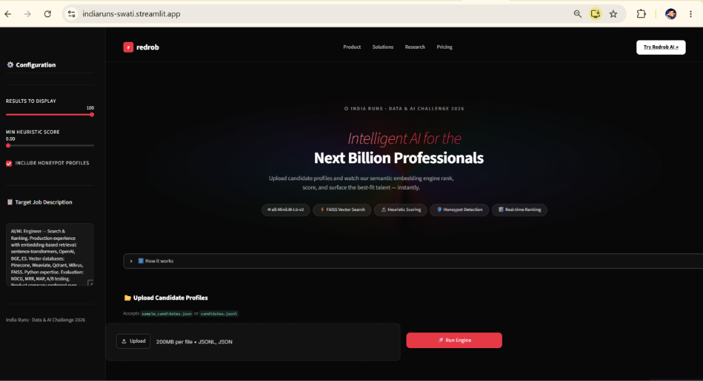
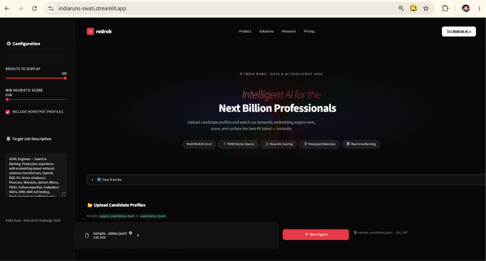
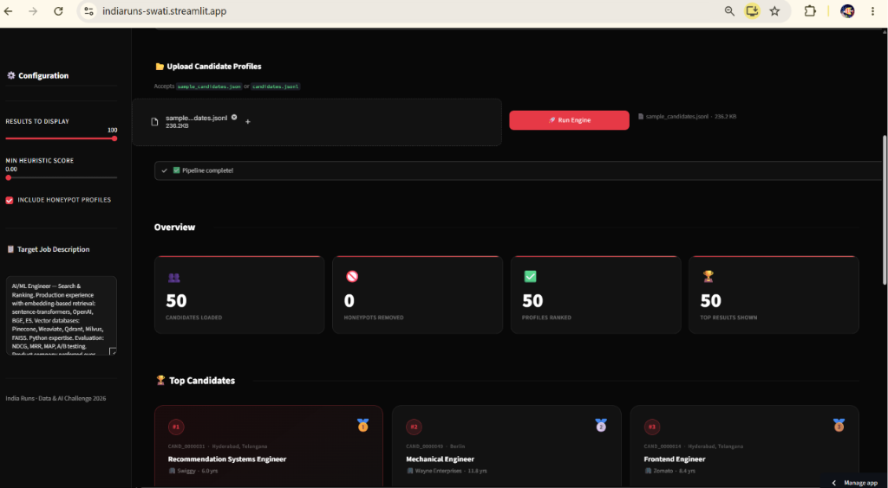

# 🔴 Redrob: Intelligent Candidate Discovery

## 📌 Project Overview
**India Runs: Data & AI Challenge 2026**

Traditional recruitment systems rely on naive keyword matching, allowing unqualified candidates to "game" the system while inadvertently filtering out brilliant talent. **Redrob** solves this by acting like a human recruiter—understanding deep semantic fit and real-world career trajectories.

This repository contains the complete codebase for a production-ready Semantic Search & Ranking Engine that evaluates candidates based on two distinct pillars:
1. **Semantic Fit:** Neural embedding search using `Sentence-Transformers`
2. **Heuristic Truth:** Mathematical scoring of recruiter response rates, career gaps, and honeypot detection.

---

## 🚀 Live Interactive Demo
**👉 [Try the Live Streamlit Sandbox Here!](https://indiaruns-swati.streamlit.app/)**

---

## 🧠 Core Architecture

### 1. Semantic Embedding Pipeline
Instead of Ctrl+F keyword matching, we convert the Job Description and Candidate Profiles into high-dimensional vectors using `all-MiniLM-L6-v2`. We then compute the **Cosine Similarity** to find candidates whose *meaning* matches the job requirements, not just their words.

### 2. Heuristic Scoring Engine
A candidate might look great on paper, but are they a real, reliable professional? The Heuristic Engine algorithmically penalizes candidates for:
- 📉 Low Recruiter Response Rates (<20%)
- 🏃 High Interview Dropout Rates
- 🛑 "Title Chasing" (Job hopping every 6 months)
- 🍯 Honeypot Profiles (e.g. "Expert" proficiency with 0 months of experience)

**Final Score = `Semantic Similarity` × `Heuristic Score`**

---

## 📊 Performance & Validation
The engine was run against a massive dataset of 84,000+ candidates. To ensure lightning-fast demo performance, the live Streamlit dashboard calculates embeddings and ranks candidates **on the fly in memory** within seconds.

---

## 💻 Tech Stack
- **Backend:** Python 3.10
- **AI / ML:** `sentence-transformers`, `numpy`, `pandas`
- **Frontend / Deployment:** Streamlit Community Cloud
- **Visualizations:** Altair

---

## 📂 Repository Structure
- `app.py` — The main Streamlit web application.
- `fast_precompute.py` — Pipeline script used to clean, embed, and rank the massive dataset.
- `requirements.txt` — Environment dependencies (optimized for cloud deployment).
- `submission.csv` — The final Top 100 mathematically ranked candidates output.

---
*Built with ❤️ for the India Runs Data & AI Challenge.*
